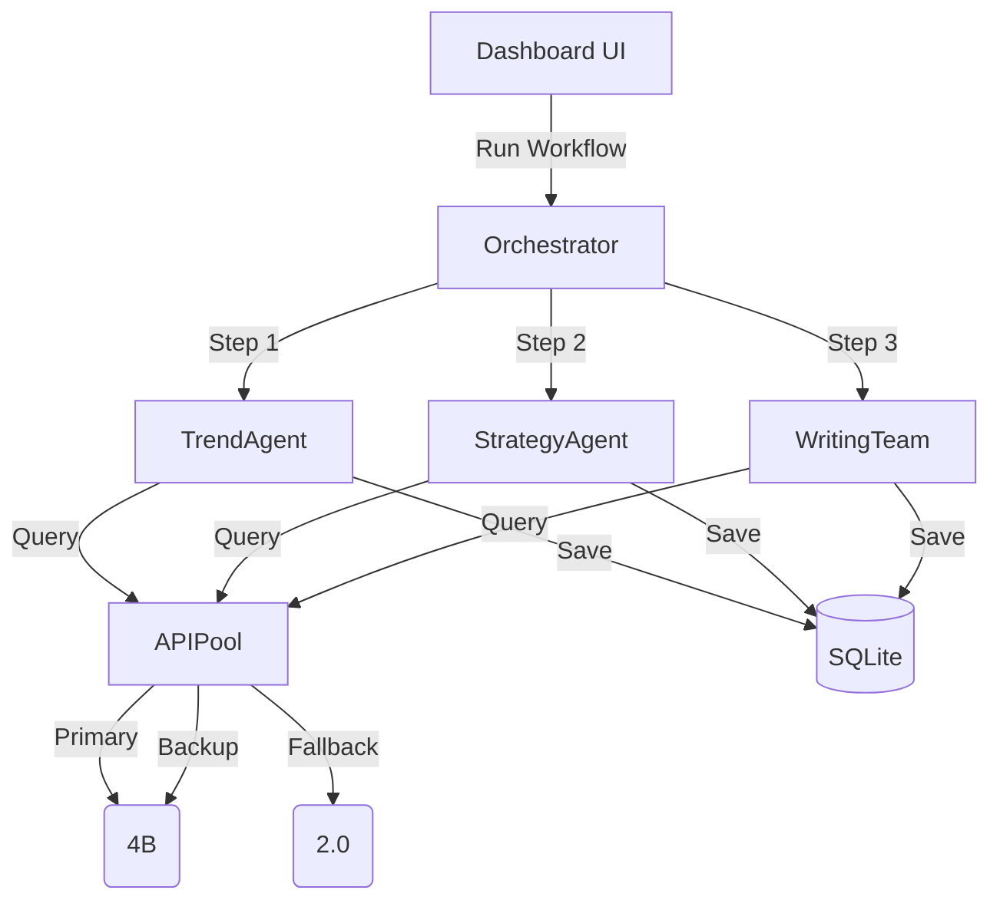

# LinkedIn AI Manager - System Design

## 1. Overview
The **LinkedIn AI Manager** is an autonomous content creation system that leverages a **multi-model Intelligent API Pool** (Gemini & Gemma) to discover trends, strategize content, and generate viral LinkedIn posts.

## 2. Architecture

### Core Components
1.  **Orchestrator (`core/orchestrator.py`)**: The central brain that manages the workflow state, handles errors, and coordinates agents.
2.  **Plugin Manager (`core/plugin_manager.py`)**: Dynamically loads LLM and Search providers.
3.  **API Pool (`core/api_pool.py`)**: 
    -   Manages multiple AI models simultaneously.
    -   **Routing**: Uses "Priority" strategy (Gemma 27B Primary -> Gemma 4B Backup -> Gemini 2.0 Fallback).
    -   **Quota**: Tracks Daily Quota and automatically switches models if one fails (429/Exhausted).
4.  **Rate Limiter (`core/rate_limiter.py`)**: Prevents API flooding.

### Data Flow

## 3. Key Features

### 🧠 Intelligent Model Selection
The system uses a tiered priority system to maximize quality while minimizing cost/errors:
-   **Priority 100**: `gemma-3-27b-it` (High Quality, 1500 RPD)
-   **Priority 95**: `gemma-3-12b-it`
-   **Priority 90**: `gemma-3-4b-it`
-   **Priority 50**: `gemini-2.0-flash` (20 RPD, Fallback)

### 🚦 Dashboard & UX
-   **Real-Time Console**: AJAX-based polling shows live workflow logs without page reloads.
-   **Full CMS**: 
    -   **Edit**: Modify drafts manually.
    -   **Improve**: One-click AI enhancement of posts.
    -   **Revoke**: Revert approved posts to draft for editing.
    -   **Bulk Actions**: Delete multiple posts at once.

### 🛡️ Robustness
-   **Lazy Loading**: Agents are imported only when needed to prevent circular dependencies.
-   **Error Handling**: comprehensive try/catch blocks with user-friendly error messages.
-   **Quota Awareness**: Automatically stops or switches strategies if APIs are exhausted.

## 4. Database Schema
-   **Trends**: Stores discovered news/topics.
-   **WeeklyPlans**: High-level strategy for the week.
-   **Posts**: The actual content (Draft -> Approved -> Posted).
